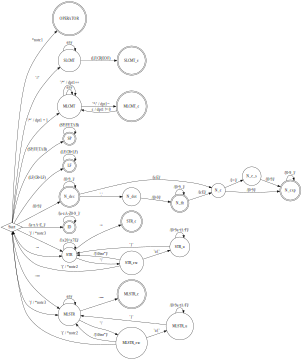

<style>
    * {
        box-sizing: border-box !important;
      }

    :root {
        --text-color: white;
        --background-color: transparent;
    }

    .center {
        display: block;
        margin: 0 auto;
        text-align: center;
    }

    .katex-display {
        padding: 5px 0;
    }

    .katex-display .newline {
        margin-top: 15px;
    }

    img {
        padding: 10px;
    }

    h2 {
        margin-top: 2.7em !important;
    }

    h3 {
        margin-top: 2em !important;
    }

    h4 {
        margin-top: 1.5em !important;
    }

    @media print {
        body {
            border: 10mm solid var(--background-color);
        }
    }

    @media print {
        .pagebreak {
            break-after: page;
        }
    }
</style>

<style>
    .h1 {
        font-size: 38px;
        font-weight: 600;
    }

    .h2 {
        font-size: 24px;
    }

    .h3 {
        font-size: 18px;
    }

    .markdown-body {
        font-size: 14px;
    }

    .markdown-body table td,
    .markdown-body table th {
        padding: 0.1em 0.4em;
        vertical-align: middle;
           text-align: center;
    }

    .markdown-body table th {
        font-weight: 400;
    }

    h3[id="ll-tabuľka"] + table {
        margin: 0px -50px;
        min-width: 121.25vw;
        max-width: 121.25vw;
        font-size: 11px;
    }
</style>

<style>
.pagebreak {
    height: 0px !important;
    margin: 0 !important;
    padding: 0 !important;
}
</style>

<header>
<br>
<br>
<br>
<br>
<br>

<p class="h1 center">Dokumentácia</p>
<p class="h2 center">Implementácia prekladaču imperatívneho<br>jazyka IFJ23</p>
<p class="h3 center">Tím xlouma00, variant TRP</p>

<br>
<br>
<br>

<span class="center"><b>Jaroslav Louma (xlouma00) 25%</b></span>
<span class="center">Veronika Krobotová (xkrobo03) 25%</span>
<span class="center">Radim Mifka (xmifka00) 25%</span>
<span class="center">Jaroslav Novotný (xnovot2r) 25%</span>

<br>
<br>
<br>

<span class="center">Rozšírenia:</span>
<p>
    <small class="center">OVERLOAD</small>
    <small class="center">INTERPOLATION</small>
    <small class="center">BOOLTHEN</small>
    <small class="center">CYCLES</small>
    <small class="center">FUNEXP</small>
</p>
</header>


<div class="pagebreak"></div>


# Obsah
- [Obsah](#obsah)
- [Tím](#tím)
  - [Detaily o práci v tíme](#detaily-o-práci-v-tíme)
  - [Technické detaily](#technické-detaily)
    - [Lexikálna analýza](#lexikálna-analýza)
    - [Syntaktická analýza](#syntaktická-analýza)
      - [Analýza rekurzívnym zostupom](#analýza-rekurzívnym-zostupom)
      - [Precedenčná analýza](#precedenčná-analýza)
    - [Sémantická analýza](#sémantická-analýza)
      - [Deklarácie](#deklarácie)
      - [Prechody](#prechody)
      - [Vyhodnocovanie overloadov](#vyhodnocovanie-overloadov)
    - [Generátor kódu](#generátor-kódu)
      - [Generovanie programu](#generovanie-programu)
        - [Vstavané funkcie](#vstavané-funkcie)
        - [Vnútorné funkcie](#vnútorné-funkcie)
        - [Generovanie hlavnej časti programu](#generovanie-hlavnej-časti-programu)
  - [Dátové štruktúry](#dátové-štruktúry)
    - [HashMap](#hashmap)
    - [HashSet](#hashset)
    - [Array (Stack/Queue)](#array-stackqueue)
    - [String](#string)
    - [TextRange](#textrange)
  - [Vnútorné súčasti](#vnútorné-súčasti)
    - [MemoryAllocator](#memoryallocator)
    - [InspectorAPI](#inspectorapi)
    - [Assertf](#assertf)
    - [Ostatné](#ostatné)
  - [Záver](#záver)
    - [Poďakovanie](#poďakovanie)
  - [FSM Lexikálneho analyzátora](#fsm-lexikálneho-analyzátora)
    - [Diagram](#diagram)
    - [Dôležité poznámky](#dôležité-poznámky)
    - [Gramatika označení prechodov](#gramatika-označení-prechodov)
    - [Legenda stavov](#legenda-stavov)
  - [LL](#ll)
    - [LL Gramatika](#ll-gramatika)
    - [LL Tabuľka](#ll-tabuľka)
  - [Precedenčná tabuľka](#precedenčná-tabuľka)


<div class="pagebreak"></div>


# Tím

1. Jaroslav Louma
    * Dizajn projektu
    * Vnútorné utility projektu
    * Testovací framework
    * Lexikálna analýza
    * Sémantická analýza
    * Rekurzívna syntaktická analýza
    * Dokumentácia
    * Unit testy
2. Veronika Krobotová
    * Precedenčná syntaktická analýza
    * Unit testy
2. Radim Mifka
    * Vnútorné utility projektu
    * Rekurzívna syntaktická analýza
    * Unit testy
1. Jaroslav Novotný
    * Dizajn generátora kódu
    * Generátor kódu
    * E2E testy

## Detaily o práci v tíme

Spoločne sme sa všetci podieľali na implementácii jazyka IFJ23, ktorý je podmnožinou jazyka Swift, prekladaného do jazyka symbolických adries IFJCode23, ktorý sa následne interpretuje pomocou dodaného interpreta.

Projekt sme vyvíjali v jazyku C, na vývoj sme používali VS Code / CLion, kód sme verziovali pomocou systému GitHub ([git.loumadev.eu/IFJ2023](https://git.loumadev.eu/IFJ2023)) a na komunikáciu a kolaboráciu sme používali Discord a Google Meet.

Aj napriek tomu, že niektorí z nás už skúsenosti s vytváraním prekladačov mali, sa každý z nás naučil niečo nové.

<!-- <div class="pagebreak"></div> -->
<br><br><br><br><br>
<br><br><br><br><br>
<br><br><br><br><br>
<br><br>

## Technické detaily

V projekte sme využívali objektovo orientovaný spôsob programovania, tj. každá štruktúra obsiahnutá v samostatnom súbore predstavuje triedu, kde funkcie začínajúce názvom tejto štruktúry sú metódy definované v tejto triede. Hlavičkové súbory obsahujú _len_ metódy (funkcie), ktoré majú byť dostupné pre ostatné súčasti projektu. Ostatné funkcie, ktoré sú len pre vnútorné použitie daného komponentu sú definované v súbore s ich implementáciou a sú prefixované reťazcom `__`. Voľne prístupné funkcie majú kompletnú dokumentáciu kompatibilnú so systémom Doxygen.

Projekt okrem súborov obsahujúcich priamo komponenty zodpovedné za kompiláciu kódu obsahuje aj vnútorné súčasti (implementácie dátových štruktúr, makier, ...).

Projekt má vo svojom základe adresárovú štruktúru, ktorá ale pri odovzdaní nebola povolená, preto pred odovzdaním boli všetky súbory preprocessnuté tak, aby boli kompatibilné s podmienkami zadania. Súbory obsahujú informácie o pôvodnej štruktúre projektu.

### Lexikálna analýza

Lexikálna analýza sa skladá z konečného stavového automatu (FSM), ktorý neobsahuje explicitné stavy, tj. jeho stav je určený aktuálnym znakom, aktuálnou funkciou a stavovými premennými. Implementácia lexikálneho analyzátoru (lexer) sa nachádza v súbore `Lexer.c`. Hlavnou úlohou lexeru v našom projekte je prevádzanie vstupného toku znakov čítaného zo štandardného vstupu na tok väčších stavebných blokov, v našej implementácii nazývaných tokeny. Štruktúra obsahujúca všetky potrebné informácie o tokene sa nachádza v súbore `Token.c`, ktoré sú napríklad o aký typ (napr. interpunkcia) a druh (napr. otáznik) tokenu sa jedná, aká je jeho hodnota (napr. číselný, string literál) alebo aký druh bielych znakov sa nachádza v jeho okolí (whitespace).

Pri prijatí prvého znaku potenciálneho tokenu sa rozhodne o čo za token by sa mohlo jednať. Následne sa zavolá funkcia, ktorá ďalej znak po znaku spracováva daný typ tokenov. Po úspešnom spracovaní aktuálneho tokenu sa token pridá do vnútorného buffru obsahujúceho tokeny na spracovanie (pretože jedna požiadavka na spracovanie nového tokenu nemusí nutne znamenať vytvorenie práve jedného tokenu (napr. interpolácia v string literáli)) a následne sa systém prideľujúci tokeny postará o jeho pridelenie žiadateľovi.

Po úspešnom spracovaní každého tokenu sa následne, separátne spracováva whitespace. V našej implementácii rozlišujeme 3 druhy whitespacu, a to:
1. Space-like
    * Aspoň jeden biely znak typu `SP`, `TAB` alebo `FF`
    * Viac-riadkový komentár rozložený práve na jednom riadku
2. Newline-like
    * Aspoň jeden biely znak typu `LF` alebo `CR`
    * Viac-riadkový komentár rozložený aspoň na dvoch riadkoch
    * Jedno-riadkový komentár
3. Limit
    * Reprezentuje markery `BOF` a `EOF`

Systém si vnútorne drží posledný priradený druh whitespacu, vďaka čomu dokáže poskytovať whitepace z oboch strán tokenu, čo sa aktívne využíva v ďalších fázach kompilácie. Táto informácie je ukladaná ako bit field, pre rýchly a efektívny prístup.

Pre rozšírenie `INTERPOLATION` sme pri tokenizácii string literálov museli dávať pozor na špeciálnu escape sekvenciu `\(...)`, kde sa na mieste `...` mohol nachádzať akýkoľvek počet ďalších tokenov. Tento problém sme vyriešili tak, že pri nájdení takejto escape sekvencie sme do token streamu umelo vložili špeciálny typ tokenu (interpolation marker), ktorý indikuje začiatok interpolačného výrazu v stringu. Následne sa zavolá funkcia, ktorá má na starosti tokenizáciu tokenov obsiahnutých v tejto escape sekvencii. Funckia rekurzívne žiada o nové tokeny, čo umožňuje zanorenie takýchto escape sekvencií; zároveň sleduje výskyt zátvoriek v interpolačnom výraze a ak ich počet dosiahne `0`, ukončí tokenizáciu a vráti sa späť do funkcie tokenizujúcej string literál. Následne sa do token streamu vloží ďalší špeciálny token, značiaci koniec interpolačného výrazu. Text medzi jednotlivými interpoláciami a začiatkom/koncom string literálu sa rozdelí do samostatných string literálov. Tento proces sa deje v cykle, čo umožňuje mať takýchto escape sekvencií v jednom string literáli viac. Po dokončení tokenizácie interpolačného string literálu sa prvý interpolation marker nastaví na druh `head` a posledný na druh `tail`, čo umožní korektné spracovávanie v ďalších fázach kompilácie.

### Syntaktická analýza

Syntaktická analýza je realizovaná prostredníctvom postupného zanorovania na základe tokenov, poskytnutých lexikálnym analyzátorom a výrazy sú spracované na základe precedenčnej tabuľky. Tieto procesy sú známe ako analýza rekurzívnym zostupom a precedenčná analýza.

#### Analýza rekurzívnym zostupom

Analýza rekurzívnym zostupom závisí od sady pravidiel, ktoré definuje LL Tabuľka gramatiky. Má za úlohu rozpoznať a pretvoriť získavané tokeny na zodpovedajúce uzly `ASTNodes` abstraktného syntaktického stromu, ktorý vo výsledku tvorí celkovú štruktúru vstupného programu.

V súbore `Parser.c` sa nachádza implementácia parseru, ktorý komunikuje s lexikálnym analyzátorom pomocou funkcie `Lexer_nextToken`. Parser na základe prijatého tokenu rozhoduje, o ktoré pravidlo gramatiky alebo jeho súčasti aktuálne ide. Každé pravidlo je implementované ako samostatná funkcia, do ktorých sa postupne zanára, vytvárajúc tak stromovú štruktúru zvanú `AST` (Abstract Syntax Tree). Ak parser deteguje token, ktorý nesúhlasí s aktuálnou syntaxou, vyvolá chybu syntaktickej analýzy.

Pri spracovaní výrazov sa riadenie odovzdáva precedenčnej analýze `ExpressionParser` a ďalej, potom pracuje už s vyhotoveným výrazom a pokračuje ďalej vo vytváraní ďalších uzlov.

Pokiaľ parser úspešne spracuje všetky vytvorené tokeny, vráti syntaktický strom celého vstupného programu. Tento strom následne slúži ako vstup pre sémantickú analýzu, ktorá vykonáva ďalšie overenie a analýzu významu programu.

#### Precedenčná analýza

Precedenčná analýza výrazov je implementovaná v súbore `ExpressionParser.c`. Analýza prebieha na základe precedenčnej tabuľky. Pre precedenčnú analýzu sú použité dva zásobníky - hlavný a pomocný, oba implementované ako dynamické pole pomocou štruktúry `Array`. Hlavný zásobník slúži na uchovanie tokenov a medzivýsledkov počas analýzy a je z neho odobraný konečný výsledok analýzy, ktorý je pomocou makra `ParserSucces` spoločne s riadením odovzdaný späť rekurzívnej analýze. Pomocný zásobník je využívaný na redukciu pravidiel, pri ktorých sa vytvárajú jednotlivé vetvy AST. V prípade neúspešnej redukcie vracia precedenčná analýza rekurzívnej analýze `ParserError`. Zásobníky obsahujú štruktúru `StackItem`, ktorá v sebe uchováva ukazovateľ na token, ukazovateľ na vetvu AST, informáciu o tom, či je token terminál alebo neterminál a v dôsledku rozšírenia `BOOLTHEN` obsahuje aj informáciu o tom, či je operátor postfixový alebo prefixový.

Obslužná rutina v prípade, keď precedenčná tabuľka vráti symbol `X` (značiaci chybu), spočíva v snahe o úspešné spracovanie (redukciu) súčasného obsahu hlavného zásobníka. Pokiaľ je pokus neúspešný, vráti precedenčná analýza chybový kód a hlášku, v opačnom prípade sa výraz úspešne vyhodnotí.

Do precedenčnej analýzy bolo pridaných niekoľko rozšírení. `BOOLTHEN` je implementované pridaním operátorov do precedenčnej tabuľky. `FUNEXP` a `INTERPOLATION` sú riešené pomocou kontroly súčasne spracovávaného a nadchádzajúceho tokenu. Pokiaľ je vyhodnotené, že sa jedná o funkciu alebo string interpolation, je zavolaná funkcia `parseFunctionCallExpression` resp. `parseStringInterpolation`; po spracovaní časti výrazu pomocnými funkciami analýza ďalej pokračuje.

### Sémantická analýza

Po úspešnom vytvorení syntaktického stromu (AST) syntaktickým analyzátorom sa prevádza sémantická analýza, ktorá má za úlohu zistiť, či je daný program v súlade s pravidlami jazyka IFJ23. Jedná sa o najkomplexnejšiu časť projektu.

<br>

#### Deklarácie

Keďže sémantická analýza (analyzátor - analyser) a generovanie kódu v našej implementácii silne spolupracujú, vymysleli sme spôsob, ako uspokojiť obe strany, a to tak, že každému úspešne vyhodnotenému identifikátoru priradíme unikátne ID. Tým sa stratia všetky problémy s redefiníciou premenných s rovnakým názvom v inom scope a preťaženie funkcií, a bude sa tak dať jednoznačne určiť o ktorú deklaráciu sa jedná. Informácie o všetkých deklaráciách si analyzátor uchováva v štruktúre `HashMap` aby k nim vedel rýchlo pristupovať (indexované podľa ID).

Deklarácie premenných sa z pohľadu generátora dajú rozdeliť do dvoch kategórií:
1. premenné deklarované v globálnom scope (program scope)
2. premenné deklarované v scope funkccie (function scope)

Premenné, ktoré sú deklarované v niektorom z globálnych scopov (napr. premenná v konštrukcii `if`), sú ukladané na jednom mieste v štruktúre `HashMap`, osobitne od premenných definovaných vo funkciách. Pri analýze sa overí, či je prístup k danej premennej validný, tým pádom je bezpečné považovať všetky premenné za globálne.

Obdobne to funguje aj pri premenných deklarovaných vo funkciách, avšak tie sa ukladajú pre každú funkciu osobitne.

#### Prechody

Naša implementácia silne benefituje z možnosti viac-prechodovej analýzy, a to v troch krokoch (prechodoch):
1. Vytvorenie zreťazenia scopov (block scope chaining):
    * Rekurzívnym prechodom AST sa vytvárajú bloky scopov, ktoré obsahujú:
        * štruktúru `HashMap`, ktorá uchováva informácie o deklarovaných premenných (indexovaných názvom)
        * referenciu na funkciu alebo cyklus, ktorej je daný scope súčasťou (ak existuje)
        * referenciu na vyšší scope (ak existuje)
    * Vďaka týmto informáciám sa dá riešiť prekrývanie premenných (variable shadowing), validácia `return`, `break` a `continue` statementov, ale aj efektívnejšia generácia výsledného kódu.
2. Zber deklarácií funkcií:
    * Lineárnym prechodom hlavného tela programu sa zozbierajú všetky deklarácie funkcií.
    * Detekcia podobnosti voči ostatným deklarovaným funkciám s rovnakým názvom (overload redeclaration).
    * Priradenie unikátneho ID premennej podľa ktorej sa bude identifikovať.
    * Vytvorenie vnútorných deklarácií pre parametre funkcie.
3. Analýza celého programu
    * Rekurzívnym prechodom AST sa vyhodnotí každý jeden uzol `ASTNode`.

#### Vyhodnocovanie overloadov

Keďže sme sa rozhodli podporovať rozšírenie `OVERLOAD`, museli sme vymyslieť spôsob akým by sme vedeli identifikovať o ktorú preťaženú (overloadovanú) funkciu sa jedná. Správny výber funkcie je ovplyvnený počtom a názvom parametrov, návratovou hodnotu a typom parametrov. Pri volaní funkcie sa najprv nájde prvá iterácia vhodných kandidátov a to tých, ktorí majú zhodný počet a názvy všetkých parametrov ako volaná funkcia. Ak sa nájde viac ako jeden kandidát a zároveň je volanie funkcie súčasťou výrazu, je snaha o implicitné pretypovanie celého výrazu tak, aby návratová hodnota kandidáta bola prijateľná v danom výraze. Ak po tejto iterácii existuje viac ako jeden kandidát, prejde sa na poslednú - tretiu iteráciu, kedy sa každému kandidátovi pridelí jednoznačné skóre, na koľko "bodov" sa zhoduje s daným volaním funkcie. Kandidát môže skóre získať ak:

* je typ n-tého argumentu rovnaký ako typ n-tého parametru (bez implicitného pretypovania)
* je nullability flag (možnosť hodnoty byť `nil`) n-tého argumentu rovnaký ako nullability flag n-tého parametru

Následne sa z týchto kandidátov vyberú tí, ktorí majú najvyššie skóre. Ak je takýchto kandidátov viac ako jeden, jedná sa o chybu a nie je možné jednoznačne určiť o volanie ktorej funkcie sa jedná.

Tento algoritmus sme vymysleli úplne sami, bez akýchkoľvek referencií a pri testovaní s originálnym jazykom Swift boli výsledky testov v 100% prípadoch totožné, čo znamená, že sa musí jednať o takmer dokonalú repliku algoritmu, ktorý na rozpoznávanie overloadov používa jazyk Swift.

### Generátor kódu
Generátor na vstupe dostáva abstraktný syntaktický strom (AST), obohatený o užitočné informácie sémantickým analyzérom a postupným rekurzívnym prechádzaním stromu generuje na výstupe kód v jazyka IFJcode23. Generátor je implementovaný v súbore `Codegen.c`. Inštrukčná sada IFJcode23 je
implementovaná v súbore `Instructions.c`. Generátor využíva zásobníkovú architektúru s drobnými optimalizáciami.

#### Generovanie programu
Generovanie programu začiná vygenerovaním hlavičky IFJcode23. Následne sa generujú pomocné globálne premenné. Tie slúžia
pre vybrané špecifické vstavané funkcie (napr. `write(...)`) na uchovávanie a manipuláciu s argumentami alebo návratovými
hodnotami. Ako ďalšia časť nasleduje vygenerovanie inštrukcie `JUMP $main`, ktorá preskočí ostatné pomocné deklarácie
(viz. nižšie). Následne sa generujú vstavané funkcie, po nich nasledujú uživateľom definované funkcie.

Po vygenerovaní týchto pomocných štruktúr sa vygeneruje návestia `$main` (`LABEL $main`) a začne sa generovanie hlavnej
časti programu.

##### Vstavané funkcie

Niektoré builtin funkcie sú implementované priamo v generátore kódu. Tieto funkcie sa vygenerujú len v momente, keď
analýzator nájde ich výskyt. Medzi tieto funkcie patrí `ord`, `length`, `chr`, `substr`. V momente keď generátor
narazí na volanie týchto funkcií, vygeneruje sa obsluha volania inštrukcie a inštrukcia `CALL` na danú funkciu. Ak 
funkcia vracia hodnotu (teda návratový typ nie je typu `void`), taktiež sa generuje obsluha tejto návratovej hodnoty, 
ktorá sa vloží na vrchol zásobníka.

##### Vnútorné funkcie

Generátor kódu prekladá aj niekoľko vnútorných funkcií, ktoré slúžia na prevod dát a manipuláciu s nimi pri
reťazcovej interpolácii. Tieto funkcie sú implementované v jazyku Swift a ich kód je podhodený generátoru kódu ktorý
ich preloží do jazyka IFJcode23. Generátor teda vníma interpoláciu ako akúľovek inú (uživateľom definovanú) funkciu.

Vďaka tomuto prístupu je implementácia interpolácie pre nás jednoduchšia, keďže sa pracuje len z jazykom Swift, ktorý 
zakrýva nízkoúrovňovú implementáciu. To sa hodí, keďže pri interpolácií sa musí implemenovať veľa operácií, ktoré nemajú 
priamu podporu v inštrukčnej sade (modulo) a aj sa musí volať veľa funkcií už implementovaných funkcií - chr, int2double a iné.
Volanie takýchto funkcií znamená aj veľa obsluhy, kde sa pri ručnom písaní môže ľahko zaniesť chyba. Generovanie 
funckcií je oproti tomu deterministické a zadarmo (keďže je implementované nezávisle od podpory interpolácie).

##### Generovanie hlavnej časti programu

Ako prvé nastáva generovanie premenných. Okrem globálnych premenných sa generujú aj premenné, ktoré síce nie sú
globálne, ale sú z globálného rozsahu viditeľné - teda generujú sa všetky premenné okrem tých, ktoré sú definované vo
funkciách. To nám umožňuje sa efektívne vyhýbať opakovaným deklaráciam - napr. v cykle. Pre funkcie potom platí 
identická filozofia, ktorá poskytuje identické výhody. Pri funkciách sa to hodí najmä pri rekurzií. Následne sa generuje 
telo programu.

Vďaka použitu zásobníkovej architektúry sme získali zadarmo schopnosť spracovávať zložité výrazy, keďže ich výsledky 
sa postupne zoskupujú na zásobníku. Podobné platí aj pre rekurziu - výsledky volaní netreba nikam ukladať, pretože 
ostanú na zásobníku.

<!-- <div class="pagebreak"></div> -->

<br><br><br><br><br>

## Dátové štruktúry

Všetky dátové štruktúry boli navrhnuté tak, aby boli kompatibilné s InspectorAPI, podrobne opísaného ďalej v tomto dokumente.

### HashMap

Implementácia sa nachádza v súboroch `HashMap.h` a `HashMap.c`.

Štruktúra `HashMap` reprezentuje tabuľku s rozptýlenými položkami, implementovanú prvotne schémou separate chaining, ktorá ale následne po dôkladnom preštudovaní zdania musela byť zmenená na schému open adressing, aby bola v súlade so zadaním. Tabuľka je reprezentovaná ako dynamické pole, ktoré obsahuje jednotlivé záznamy. Každý záznam obsahuje informáciu o kľúči (v našom prípade je to hodnota C stringu) a hodnote, ktorá je reprezentovaná generickým pointerom. Štruktúra obsahuje základné API metódy (funkcie) na pridanie/odobranie prvku a na zistenie, či sa daný prvok v tabuľke nachádza.

**Poznámka:** Podľa zadania by mal súbor `symtable.c` obsahovať implementáciu práve tejto tabuľky, čo však u nás nebolo možné zrealizovať, nakoľko súbor `symtable.c` počíta s tým, že sa daná tabuľka využíva _len na uchovávanie informácií o symboloch_, čo však v prípade nášho súboru `HashMap.c` nie je pravda, a preto sme sa rozhodli dať túto implementáciu do samostatného súboru, a zo súboru `symtable.c` túto implementáciu len importovať (tak, aby to bolo v súlade so zadaním ale aj logicky rozčlenené). V našom projekte sa štruktúra `HashMap` využíva na rôznych miestach a na rôzne použitie, nie len na ukladanie symbolov.

Dátová štruktúra sa aktívne využíva v časti sémantickej analýzy a generovania kódu.

### HashSet

Implementácia sa nachádza v súboroch `PointerSet.h` a `PointerSet.c`.

Štruktúra s konštantným prístupom, veľmi podobná štruktúre `HashMap` s tým rozdielom, že vnútorné záznamy obsahujú len hodnoty, ktorých dáta sú použité zároveň ako kľúče. Štruktúru sme implementovali pomocou schémy separate chaining, je však zjednodušená na statické pole, tj. load factor nie je prítomný (čím viac záznamov set obsahuje, tým je šanca na kolíziu vyššia). Táto štruktúra sa používa len v časti manažmentu pamäti, ktorá bude podrobne opísaná neskôr v tomto dokumente.

Dátová štruktúra sa aktívne využíva v časti pamäťovej alokácie.

### Array (Stack/Queue)

Implementácia sa nachádza v súboroch `Array.h` a `Array.c`.

V našej implementácii, dátová štruktúra slúži primárne ako dynamicky alokované pole, ktoré je rozšírené o bohatú sadu API metód, ktoré s týmto poľom umožňujú pracovať ako so zásobníkom alebo frontou (`push`/`pop` a `unshift`/`shift`). Taktiež obsahuje rôzne iné metódy na uľahčenie práce s poľami (`slice`, `splice`, `insert`, `join` a mnoho ďalších). Rovnako tak obsahuje aj metódu `fromArgs`, pomocou ktorej sa alokuje nové pole, do ktorého sa automaticky pridajú hodnoty z argumentov. Štruktúra je uložená ako blok kontinuálnej pamäti, pre rýchli prístup; má tiež schopnosť automatickej realokácie svojej pamäti v prípade potreby (napr. pridanie nového prvku do poľa s plnou kapacitou). Prvky poľa sú generické pointre.

Dátová štruktúra sa aktívne využíva v každej časti projektu.

<br><br><br><br><br>

### String

Implementácia sa nachádza v súboroch `String.h` a `String.c`.

Štruktúra `String` umožňuje dynamickú prácu s reťazcami, podobne ako štruktúra `Array`. Rovnako ako pri štruktúre`Array`, táto štruktúra obsahuje bohaté API, vďaka ktorému je možne robiť takmer všetky bežné reťazcové operácie. Implementovali sme aj podporu pre konvertovanie medzi poľom a reťazcom (`split` a `join`), taktiež sme implementovali konverzie dátových typov C na ich textové reprezentácie (`fromLong`, `fromDouble`, ...), či aj ikonickú funkcionalitu `printf` ako `fromFormat`.

Dátová štruktúra sa aktívne využíva v každej časti projektu.

### TextRange

Implementácia sa nachádza v súboroch `TextRange.h` a `TextRange.c`.

Jednoduchá dátová štruktúra slúžiaca ako Buffer View (reprezentuje sub-string nejakého väčšieho stringu, bez nutnosti jeho realokácie). Uchováva práve 2 pointre, a to na začiatok a koniec v cieľovom buffri (stringu). Používa sa v lexikálnej analýze na efektívnu komparáciu substringov a ako identifikácia, kde v zdrojom texte sa nejaký token nachádza (spoločne s riadkom a stĺpcom).

Dátová štruktúra sa aktívne využíva v časti lexikálnej analýzy.


<!-- <div class="pagebreak"></div> -->

<br><br><br><br><br>
<br><br><br><br><br>
<br><br><br><br><br>
<br><br><br><br><br>
<br><br><br><br><br>
<br><br><br><br><br>
<br><br><br>

## Vnútorné súčasti

### MemoryAllocator

Keďže ručný manažment pamäti v C môže byť pri väčších a komplexnejších projektoch dosť náročný, rozhodli sme sa pre implementáciu vlastného alokátora pamäti, ktorý umožňuje štandardné možnosti alokácie (`malloc`, `calloc`, `realloc` a `free`) obohatené o novú implementáciu `recalloc` (realokuje pamäť a nový blok pamäti sa inicializuje na `0`). Odlišnosťou od predvoleného C alokátora je to, že nie je nutné pri každej alokácii volať spätne funkciu `free`, pretože táto pamäť sa vnútorne ukladá do štruktúry `PointerSet` (podrobne popísanú vyššie v tomto dokumente) a pri konci programu sa všetká neuvoľnená pamäť automaticky uvoľní, čo zamedzí akékoľvek memory leaky. Rovnako tak aj garantuje validný pointer pri alokácii; pri zlyhaní alokácie sa program automaticky ukončí, čo dáva možnosť odstrániť zbytočný kód (porovnanie voči `NULL`).

### InspectorAPI

InspectorAPI slúži ako preddefinované rozhranie na výpis ladiacich hlášok a logovanie hodnôt premenných. Definuje spôsob, akým sa má obsah všetkých dátových štruktúr vypisovať. Rovnako tak definuje aj potrebné nástroje na výpis, aby boli všetky výpisy jednotné. Podporuje výpisy všetkých základných dátových typov.

Špeciálne makro `dumpvar` je navrhnuté tak, aby bolo pre vývojára čo najjednoduchšie a najrýchlejšie použiteľné. Namiesto tradičného `printf("%d", value);` stačí napísať `dumpvar(value)` a makro automaticky vypíše vhodne naformátovanú hlášku s názvom premennej, jej hodnotou, číslom riadku a cestou k súboru. Makro je preťažené (overloadované) tak, že dokáže prijímať až 8, akýchkoľvek parametrov, v akomkoľvek poradí, čím sa rýchle výpisy premenných pri ladení niekoľkokrát zefektívnili.

### Assertf

Táto súčasť obsahuje definície makier určených na zachytávanie vnútorných, neočakávaných chýb. Definuje hlavné makro `assertf`, ktoré je preťažené a dokáže prijímať podmienku, podmienku a hlášku alebo podmienku, formát a parametre. Pri nevyhovujúcej podmienke program vypíše chybovú hlášku s ladiacimi informáciami a bezpečne preruší vykonávanie programu ešte predtým, ako by potenciálne mohla nastať chyba alebo nedefinované správanie. Z toho sa ďalej derivuje makro `fassertf`, ktoré predpokladá podmienku vždy ako nevyhovujúcu, a teda pri narazení na toto makro v programe je garantované, že sa program hneď ukončí ako pri `assertf`. Posledné makro `warnf` má rovnaký účinok ako `fassertf`, avšak program sa neukončí, teda výsledkom bude len ladiaca hláška.

### Ostatné

Projekt ďalej obsahuje súčasti ako `colors.h`, ktorá definuje základné ASCII escape sekvencie na výpisy farebných hlášok alebo `overload.h`, ktorá slúži na preťaženie (overloadovanie) makier (spúšťa rôzne pod-makrá pri rôznom počte parametrov). Všetky tieto súčasti sú aktívne využívané ostatnými časťami projektu.

<br><br><br><br><br>
<br><br><br><br><br>
<br><br>

## Záver

Projekt bol pre nás aj napriek jeho zložitosti a častej negatívnej kritike od predchádzajúcich spolužiakov veľmi zaujímavý. Aj keď to bolo občas ťažké, tak projekt sme si užili a hlavne sme sa pri ňom naučili veľké množstvo informácií, nie len z odvetvia konštrukcie kompilátorov ale aj prácu s gitom, tvorbu automatizovaných akcií na GitHube, písanie testov, komunikáciu a všeobecne prácu v tíme.

### Poďakovanie

Ja, Jaroslav Louma, ako líder nášho tímu by som sa chcel oficiálne poďakovať všetkým členom môjho tímu, ktorí odviedli neuveriteľne kvalitnú prácu a boli úžasnými kolegami, ale aj kamarátmi (v ťažkých časoch). Na každého som sa mohol plne spoľahnúť, každý si splnil svoje povinnosti na 110%, aj napriek tomu, že som mal na každého vysoké nároky. Ak bolo treba niečo "narýchlo" upraviť alebo opraviť, nikto s tým nemal žiaden problém, za čo som nesmierne rád; takúto kolaboráciu si nesmierne cením. Ešte raz vám všetkým ďakujem a teším sa na našu ďalšiu spoluprácu.

<!-- <div class="pagebreak"></div> -->

<br><br><br><br><br>
<br><br><br><br><br>
<br><br><br><br><br>
<br><br><br><br><br>
<br><br><br><br><br>
<br><br><br><br><br>
<br><br><br><br><br>
<br><br><br><br><br>

## FSM Lexikálneho analyzátora

### Diagram



### Dôležité poznámky

* `*note1` - Prechod predstavuje prechody operátorov "`'...'`, `'..<'`, `'&&'`, `'||'`, `'??'`, `'=='`, `'!='`, `'>='`, `'<='`, `'->'`, `'='`, `'>'`, `'<'`, `'+'`, `'-'`, `'*'`, `'/'`, `'('`, `')'`, `'{'`, `'}'`, `','`, `':'`, `';'`, `'='`, `'?'` a `'!'`". (Nie je zahrnuté v diagrame z veľkostných dôvodov.)
* `*note2` - Z dôvodu rozšírenia `INTERPOLATION` musíme v priebehu spracovania jedného tokenu spustiť spracovanie ďalších tokenov (podrobne opísané v sekcii Lexikálna analýza); Prechody označené touto poznámkou vnútorne počítajú počet zátvoriek, a spracovávajú tokeny pokiaľ sa počet zátvoriek nerovná `0` (nie je možné opísať vo FSM, pretože takýchto počítadiel môže existovať v jednom momente viac).
* `*note3` - Rovnaký prípad ako `*note2`; Prechod sa stará o ukončenie tokenizácie konzumáciou uzatváracej zátvorky v interpolácii a pokračuje späť v spracovaní stringu.
* Na spracovanie vnorených komentárov sa používa počítadlo, v diagrame označené ako `dpt1` (operácie s touto premennou sú ekvivalentné ako v jazyku C).
* Po spracovaní viacriadkového reťazca sa prevedie validácia a sanitácia výsledného reťazca (odstránenie indentácie).
* Podľa diagramu, číselné literály môžu obsahovať znak `_` v prípadoch uvedených diagramom, avšak vo finálnej verzii našej implementácie toto nie je možné.

### Gramatika označení prechodov

Keďže FSM diagram má vcelku kryptické označenia prechodov, rozhodli sme sa vytvoriť jednoduchú gramatiku, ktorá tieto prechody popisuje (pozn.: nemusí byť z formálneho pohľadu správna, ide len o pomôcku pre čitateľa).

```js
LF => '\n'
CR => '\r'
FF => '\f'
EOF => '\0'
ε => ''
(A|B|...|N) => A | B | ... | N
/[ab...n]/ => 'a' | 'b' | ... | 'n'
/[a-d]/ => 'a' | 'b' | 'c' | 'd'
any => /[\x00-\xFF]/
A+B => '$(A)$(B)'
A+'b...n' => '$(A)b...n'
'ab...n' => (SS) -> 'a' -> (S1) -> 'b' -> (S2) -> ... -> 'n' -> (Sn) -> (ES)
'a' | 'b' | ... | 'n' => (SS) -> 'a' -> (ES) | (SS) -> 'b' -> (ES) | ... | (SS) -> 'n' -> (ES)
(SS) => (START STATE)
(ES) => (END STATE)
```

### Legenda stavov
* `SL` - Single-line
* `ML` - Multi-line
* `_e` - End (koniec; napr. čísla)
* `_s` - Sign (znamienko)
* `_u` - Unicode escape sekvencia
* `_exp` - Exponent
* `_esc` - Escape sekvencia
* `_flt` - Floating point (desatinné číslo)
* `_dec` - Decimal (decimálne (celé) číslo; podporu iných základov sme odstránili)
* `ID` - Identifikátor
* `LF` - Line Feed-like (`\n`, `\r`)
* `SP` - Space-like (` `, `\t`, `\f`)
* `N` - Číslo
* `CMT` - Komentár

## LL

### LL Gramatika

1. program → statements
2. code-block → `{` statements `}`
3. statements → statement statements
4. statements → ε
5. statement → function-declaration
6. statement → variable-declaration
7. statement → if-statement
8. statement → while-statement
9. statement → for-in-statement
10. statement → continue-statement
11. statement → break-statement
12. statement → return-statement
13. statement → expression-statement
14. expression-statement → function-call-expression
15. function-declaration → `func` function-name function-signature function-body
16. function-name → identifier
17. function-signature → parameter-clause function-result
18. function-result → `->` type
19. function-result → ε
20. function-body → code-block
21. function-body → ε
22. parameter-clause → `(` parameter-list `)`
23. parameter-list → parameter additional-parameters
24. parameter-list → ε
25. additional-parameters → `,` parameter additional-parameters
26. additional-parameters → ε
27. parameter → external-parameter-name local-parameter-name type-annotation
28. external-parameter-name → identifier
29. local-parameter-name → identifier
30. function-call-expression → function-name argument-clause
31. argument-clause → `(` argument-list `)`
32. argument-list → argument additional-arguments
33. argument-list → ε
34. additional-arguments → `,` argument additional-arguments
35. additional-arguments → ε
36. argument → argument-name `:` expression
37. argument → expression
38. argument-name → identifier
39. assignment-statement → variable-name `=` expression
40. variable-declaration → variable-head variable-declaration-list
41. variable-head → `let`
42. variable-head → `var`
43. variable-name → identifier
44. variable-declaration-list → variable-declarator additional-declarators
45. additional-declarators → `,` variable-declarator additional-declarators
46. additional-declarators → ε
47. variable-declarator → pattern initializer
48. initializer → `=` expression
49. initializer → ε
50. pattern → variable-name type-annotation
51. type-annotation → `:` type
52. type-annotation → ε
53. type → identifier
54. if-statement → `if` condition code-block else-clause
55. else-clause → `else` else-body
56. else-clause → ε
57. else-body → if-statement
58. else-body → code-block
59. condition → expression
60. condition → optional-binding-condition
61. optional-binding-condition → variable-head variable-declarator
62. while-statement → `while` condition code-block
63. for-in-statement → `for` variable-name `in` range code-block
64. range → expression range-operator expression
65. range-operator → `...`
66. range-operator → `..<`
67. continue-statement → `continue`
68. break-statement → `break`
69. return-statement → `return` expression

**Poznámky:**
* Pravidlá pre spracovanie výrazov sú popísané precedenčnou tabuľkou, nižšie v tomto dokumente.
* Pravidlá rozsahových výrazov (range) sme sa rozhodli spracovávať pomocou metódy rekurzívneho zostupu, nie precedenčnou analýzou.

<br><br><br><br><br>
<br><br><br><br><br>
<br><br><br><br><br>
<br><br><br><br><br>
<br><br>

### LL Tabuľka

|                            |   $   |  `{`  |  `}`  | `func` |  id   | `->`  |  `(`  |  `)`  |  `,`  |  `:`  | expr  |  `=`  | `let` | `var` | `if`  | `else` | `while` | `for` | `...` | `..<` | `continue` | `break` | `return` |
| :------------------------: | :---: | :---: | :---: | :----: | :---: | :---: | :---: | :---: | :---: | :---: | :---: | :---: | :---: | :---: | :---: | :----: | :-----: | :---: | :---: | :---: | :--------: | :-----: | :------: |
|          program           |   1   |       |       |   1    |   1   |       |       |       |       |       |       |       |   1   |   1   |   1   |        |    1    |   1   |       |       |     1      |    1    |    1     |
|         code-block         |       |   2   |       |        |       |       |       |       |       |       |       |       |       |       |       |        |         |       |       |       |            |         |          |
|         statements         |   4   |       |   4   |   3    |   3   |       |       |       |       |       |       |       |   3   |   3   |   3   |        |    3    |   3   |       |       |     3      |    3    |    3     |
|         statement          |       |       |       |   5    |  13   |       |       |       |       |       |       |       |   6   |   6   |   7   |        |    8    |   9   |       |       |     10     |   11    |    12    |
|    expression-statement    |       |       |       |        |  14   |       |       |       |       |       |       |       |       |       |       |        |         |       |       |       |            |         |          |
|    function-declaration    |       |       |       |   15   |       |       |       |       |       |       |       |       |       |       |       |        |         |       |       |       |            |         |          |
|       function-name        |       |       |       |        |  16   |       |       |       |       |       |       |       |       |       |       |        |         |       |       |       |            |         |          |
|     function-signature     |       |       |       |        |       |       |  17   |       |       |       |       |       |       |       |       |        |         |       |       |       |            |         |          |
|      function-result       |  19   |  19   |  19   |   19   |  19   |  18   |       |       |       |       |       |       |  19   |  19   |  19   |        |   19    |  19   |       |       |     19     |   19    |    19    |
|       function-body        |  21   |  20   |  21   |   21   |  21   |       |       |       |       |       |       |       |  21   |  21   |  21   |        |   21    |  21   |       |       |     21     |   21    |    21    |
|      parameter-clause      |       |       |       |        |       |       |  22   |       |       |       |       |       |       |       |       |        |         |       |       |       |            |         |          |
|       parameter-list       |       |       |       |        |  23   |       |       |  24   |       |       |       |       |       |       |       |        |         |       |       |       |            |         |          |
|   additional-parameters    |       |       |       |        |       |       |       |  26   |  25   |       |       |       |       |       |       |        |         |       |       |       |            |         |          |
|         parameter          |       |       |       |        |  27   |       |       |       |       |       |       |       |       |       |       |        |         |       |       |       |            |         |          |
|  external-parameter-name   |       |       |       |        |  28   |       |       |       |       |       |       |       |       |       |       |        |         |       |       |       |            |         |          |
|    local-parameter-name    |       |       |       |        |  29   |       |       |       |       |       |       |       |       |       |       |        |         |       |       |       |            |         |          |
|  function-call-expression  |       |       |       |        |  30   |       |       |       |       |       |       |       |       |       |       |        |         |       |       |       |            |         |          |
|      argument-clause       |       |       |       |        |       |       |  31   |       |       |       |       |       |       |       |       |        |         |       |       |       |            |         |          |
|       argument-list        |       |       |       |        |  32   |       |       |  33   |       |       |       |       |       |       |       |        |         |       |       |       |            |         |          |
|    additional-arguments    |       |       |       |        |       |       |       |  35   |  34   |       |       |       |       |       |       |        |         |       |       |       |            |         |          |
|          argument          |       |       |       |        |  36   |       |       |       |       |       |  37   |       |       |       |       |        |         |       |       |       |            |         |          |
|       argument-name        |       |       |       |        |  38   |       |       |       |       |       |       |       |       |       |       |        |         |       |       |       |            |         |          |
|    assignment-statement    |       |       |       |        |  39   |       |       |       |       |       |       |       |       |       |       |        |         |       |       |       |            |         |          |
|    variable-declaration    |       |       |       |        |       |       |       |       |       |       |       |       |  40   |  40   |       |        |         |       |       |       |            |         |          |
|       variable-head        |       |       |       |        |       |       |       |       |       |       |       |       |  41   |  42   |       |        |         |       |       |       |            |         |          |
|       variable-name        |       |       |       |        |  43   |       |       |       |       |       |       |       |       |       |       |        |         |       |       |       |            |         |          |
| variable-declaration-list  |       |       |       |        |  44   |       |       |       |       |       |       |       |       |       |       |        |         |       |       |       |            |         |          |
|   additional-declarators   |  46   |       |  46   |   46   |  46   |       |       |       |  45   |       |       |       |  46   |  46   |  46   |        |   46    |  46   |       |       |     46     |   46    |    46    |
|    variable-declarator     |       |       |       |        |  47   |       |       |       |       |       |       |       |       |       |       |        |         |       |       |       |            |         |          |
|        initializer         |  49   |  49   |  49   |   49   |  49   |       |       |       |  49   |       |       |  48   |  49   |  49   |  49   |        |   49    |  49   |       |       |     49     |   49    |    49    |
|          pattern           |       |       |       |        |  50   |       |       |       |       |       |       |       |       |       |       |        |         |       |       |       |            |         |          |
|      type-annotation       |  52   |  52   |  52   |   52   |  52   |       |       |  52   |  52   |  51   |       |       |  52   |  52   |  52   |        |   52    |  52   |       |       |     52     |   52    |    52    |
|            type            |       |       |       |        |  53   |       |       |       |       |       |       |       |       |       |       |        |         |       |       |       |            |         |          |
|        if-statement        |       |       |       |        |       |       |       |       |       |       |       |       |       |       |  54   |        |         |       |       |       |            |         |          |
|        else-clause         |  56   |       |  56   |   56   |  56   |       |       |       |       |       |       |       |  56   |  56   |  56   |   55   |   56    |  56   |       |       |            |         |          |
|         else-body          |       |  58   |       |        |       |       |       |       |       |       |       |       |       |       |  57   |        |         |       |       |       |            |         |          |
|         condition          |       |       |       |        |       |       |       |       |       |       |  59   |       |  60   |  60   |       |        |         |       |       |       |            |         |          |
| optional-binding-condition |       |       |       |        |       |       |       |       |       |       |       |       |  61   |  61   |       |        |         |       |       |       |            |         |          |
|      while-statement       |       |       |       |        |       |       |       |       |       |       |       |       |       |       |       |        |   62    |       |       |       |            |         |          |
|      for-in-statement      |       |       |       |        |       |       |       |       |       |       |       |       |       |       |       |        |         |  63   |       |       |            |         |          |
|           range            |       |       |       |        |       |       |       |       |       |       |  64   |       |       |       |       |        |         |       |       |       |            |         |          |
|       range-operator       |       |       |       |        |       |       |       |       |       |       |       |       |       |       |       |        |         |       |  65   |  66   |            |         |          |
|     continue-statement     |       |       |       |        |       |       |       |       |       |       |       |       |       |       |       |        |         |       |       |       |     67     |         |          |
|      break-statement       |       |       |       |        |       |       |       |       |       |       |       |       |       |       |       |        |         |       |       |       |            |   68    |          |
|      return-statement      |       |       |       |        |       |       |       |       |       |       |       |       |       |       |       |        |         |       |       |       |            |         |    69    |

<br><br><br><br><br>
<br><br><br><br><br>
<br>

## Precedenčná tabuľka
|          | `+`, `-` | `*`, `/` | `x!` | `??` | r   | i   | `(` | `)` | `!x` | `\|\|` | `&&` | $   |
| -------- | -------- | -------- | ---- | ---- | --- | --- | --- | --- | ---- | ------ | ---- | --- |
| `+`, `-` | R        | S        | S    | R    | R   | S   | S   | R   | S    | R      | R    | R   |
| `*`, `/` | R        | R        | S    | R    | R   | S   | S   | R   | S    | R      | R    | R   |
| `x!`     | R        | R        | X    | R    | R   | X   | X   | R   | R    | R      | R    | R   |
| `??`     | S        | S        | S    | S    | S   | S   | S   | R   | S    | S      | S    | R   |
| r        | S        | S        | S    | R    | X   | S   | S   | R   | S    | R      | R    | R   |
| i        | R        | R        | R    | R    | R   | X   | X   | R   | X    | R      | R    | R   |
| `(`      | S        | S        | S    | S    | S   | S   | S   | E   | S    | S      | S    | X   |
| `)`      | R        | R        | R    | R    | R   | X   | X   | R   | X    | R      | R    | R   |
| `!x`     | R        | R        | S    | R    | R   | S   | S   | R   | X    | R      | R    | R   |
| `\|\|`   | S        | S        | S    | S    | S   | S   | S   | R   | S    | R      | R    | R   |
| `&&`     | S        | S        | S    | S    | S   | S   | S   | R   | S    | R      | R    | R   |
| `$`      | S        | S        | S    | S    | S   | S   | S   | X   | S    | S      | S    | X   |

**Poznámky:**
- r: relačné operátory `==`, `!=`, `<`, `>`, `<=` a `>=`
- i: literály
- R: `>`
- S: `<`
- E: `=`
- X: Invalid
